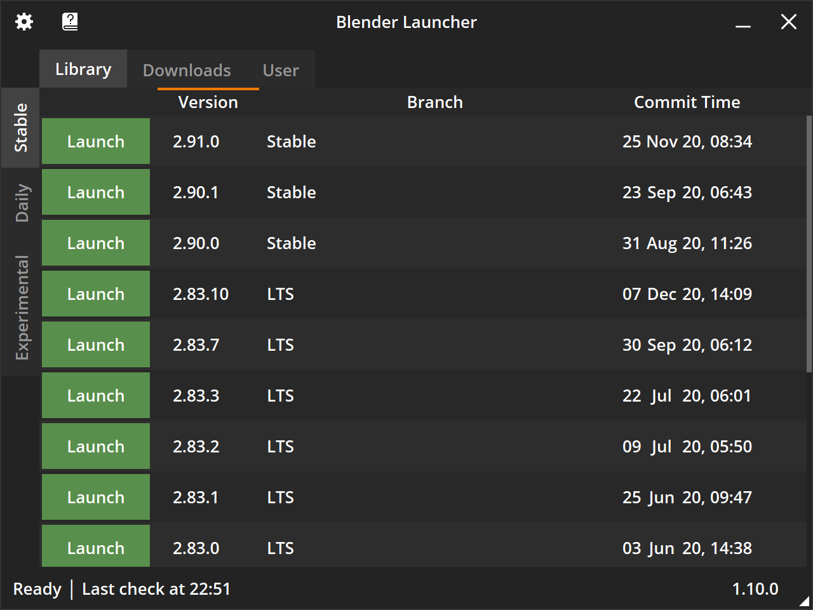
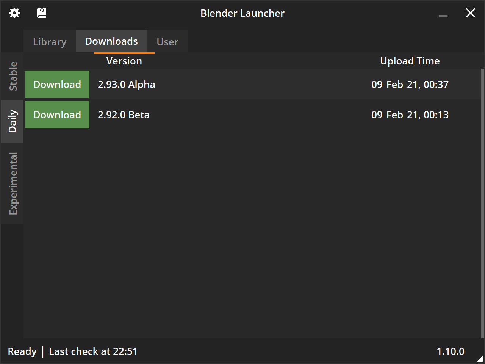
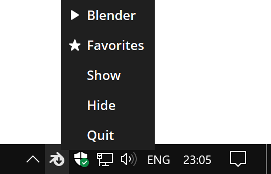

# Introduction

??? image "Screenshots"

    <figure>
      
      <figcaption>Library Tab, Stable Page</figcaption>
    </figure>
    <figure>
      
      <figcaption>Downloads Tab, Daily Page</figcaption>
    </figure>
    <figure>
      
      <figcaption>User Tab, Favorites Page</figcaption>
    </figure>
    <figure>
      
      <figcaption>Tray Icon</figcaption>
    </figure>

??? question "About"

    Documentation purpose is to help present in-depth information about Blender Launcher in a useful way. It is always under construction so feel free to ask questions on Blender Artists Community [thread](https://blenderartists.org/t/blender-launcher-standalone-software-client).

[Download Latest Release :fontawesome-solid-download:](https://github.com/DotBow/Blender-Launcher/releases/latest){: .md-button .md-button--primary .md-button-center }

## What is it?

Blender Launcher is a standalone software client that provides management for stable, daily and experimental builds of [Blender 3D](https://www.blender.org/). It is a free open source project available for 64-bit Windows and Linux (GLIBC 2.27 and higher) operating systems.

## Why do I need it?

The goal of Blender Launcher is to make it easier to stay up to date with the latest features and improvements of Blender 3D together with the security of stable releases. Being a minimalistic portable application it is a nice tool for organizing the evolving free and open source 3D creation suite.

## What features does it have?

Compared to its [predecessor](https://github.com/DotBow/Blender-Version-Manager) Blender Launcher introduces a number of major improvements:

* Rewritten from the ground up for better stability and extensibility
* All official builds are available:
    * [Stable releases](https://download.blender.org/release/)
    * [Daily builds](https://builder.blender.org/download/)
    * [Experimental branches](https://builder.blender.org/download/branches/)
* Faster starting times by caching data
* Support for high DPI displays

Core features:

* Automatic checking of latest builds
* Fast access of favorite build via tray context menu or by middle click on tray icon
* Register .blend file extension for preferred build
* Startup arguments for launching Blender
* Template installation
* Indication of running builds and its number of instances

## How to start using it?

* :fontawesome-solid-download: Download [latest version](https://github.com/DotBow/Blender-Launcher/releases/latest) from [releases page](https://github.com/DotBow/Blender-Launcher/releases)
* :fontawesome-solid-rocket: Follow [Installation](installation.md#installing-blender-launcher) instructions and notes
* :fontawesome-solid-comment: Use Blender Artists Community [thread](https://blenderartists.org/t/blender-launcher-standalone-software-client) to ask questions and make proposals

## How to thank the developer?

* :fontawesome-solid-face-smile:{: .emoji } The best reward is feedback and a happy user face!

***

:octicons-heart-fill-24:{: .heart } Thanx for using Blender Launcher! Have a good day!
